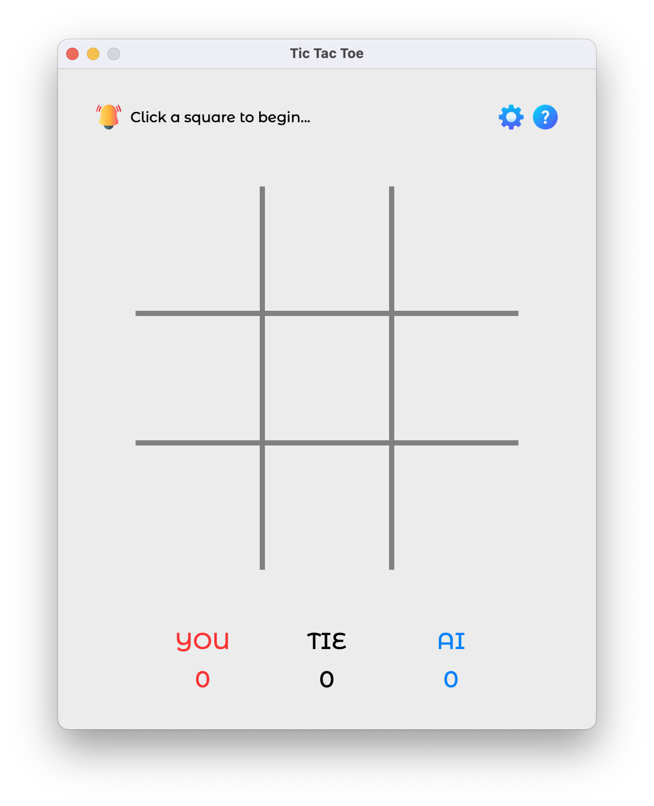
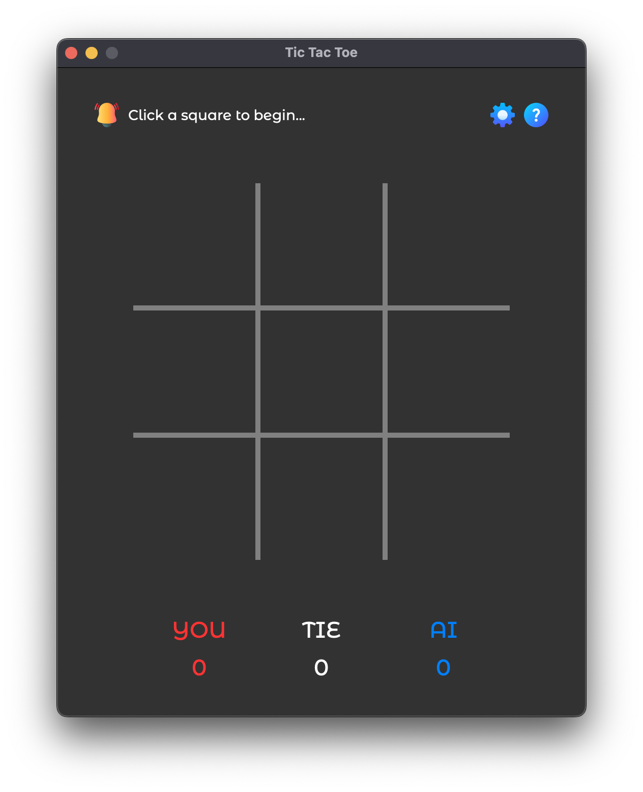
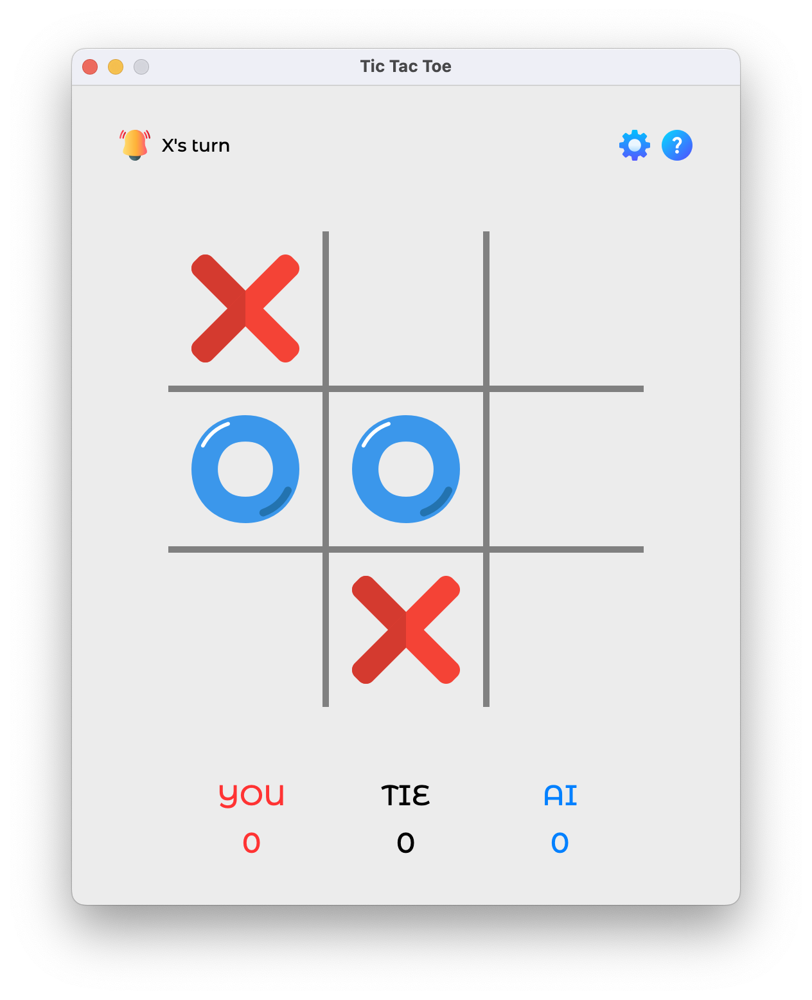
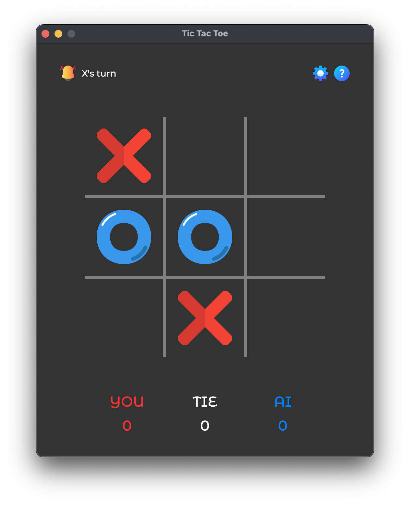
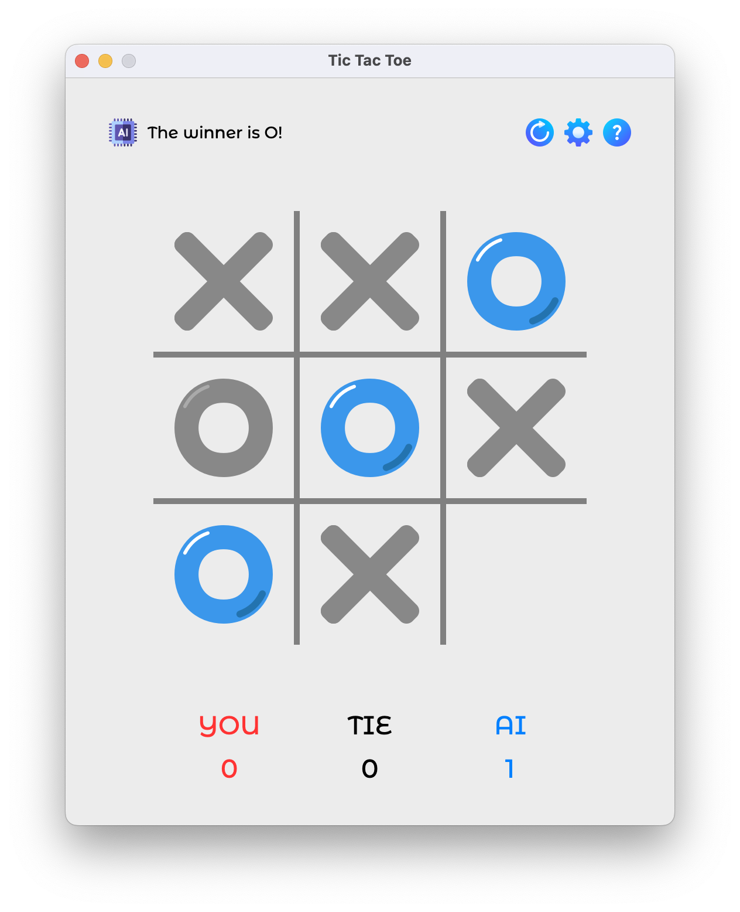
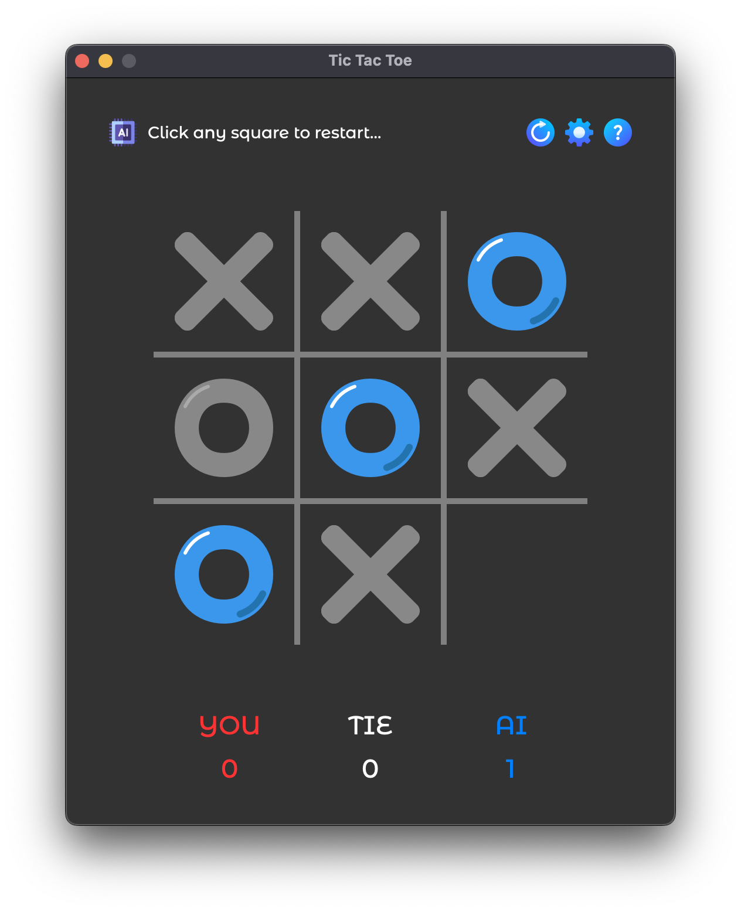
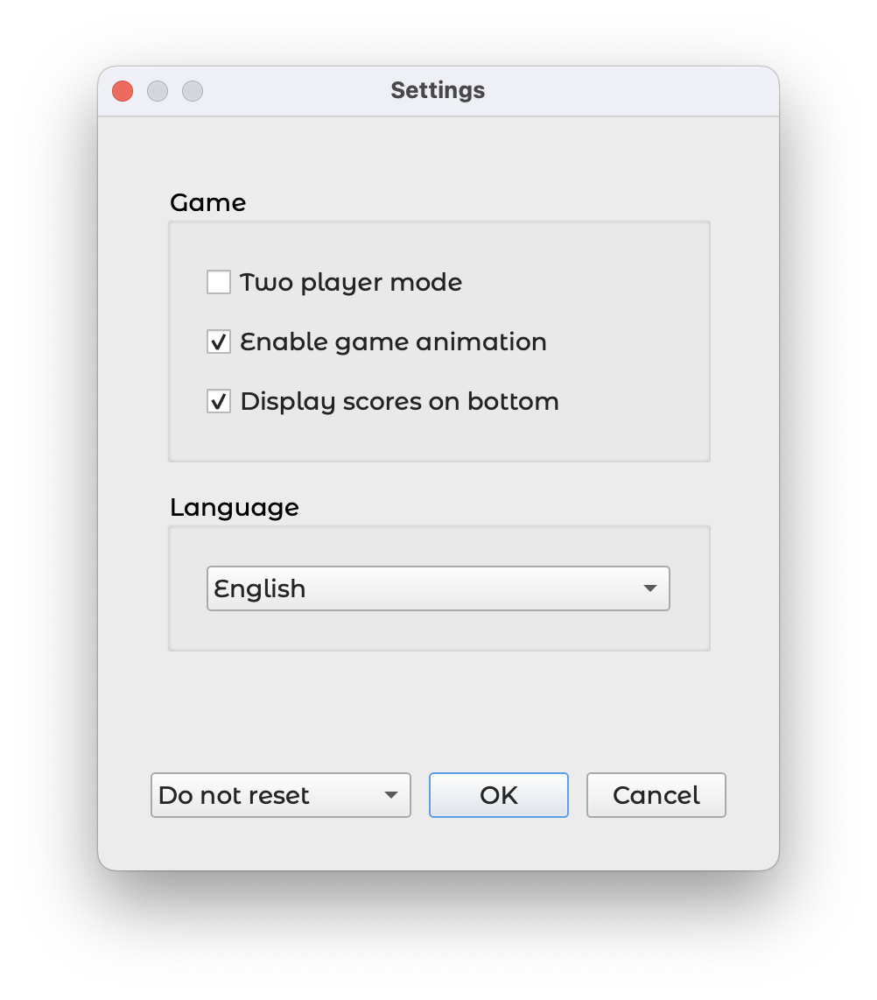
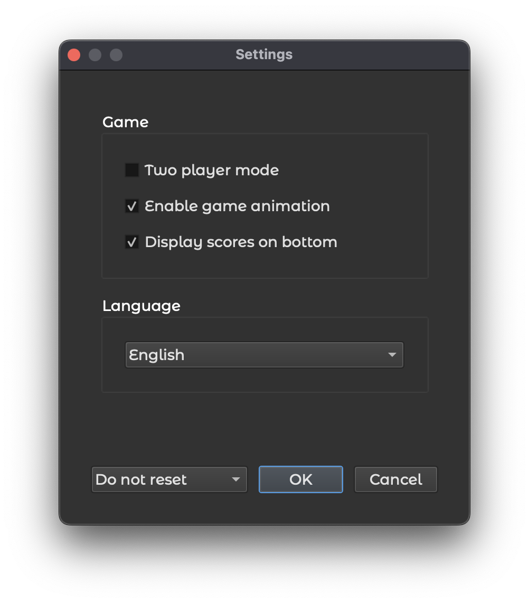
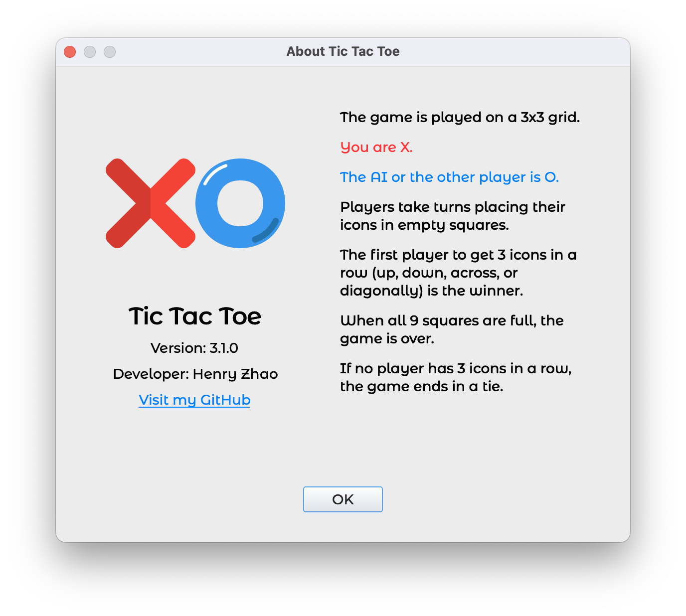
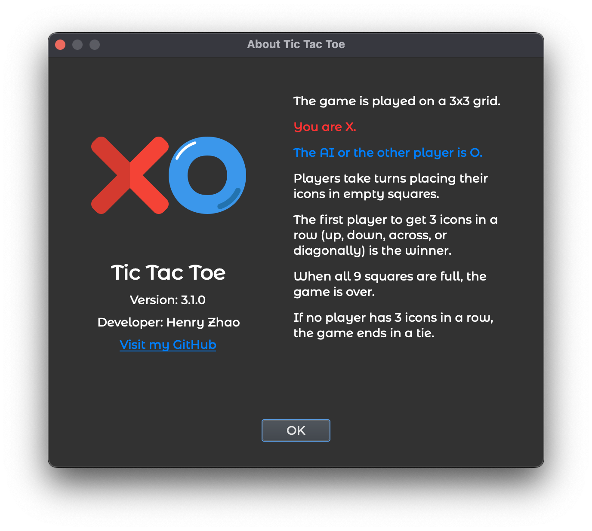

# Tic Tac Toe

An elegant, cross-platform Tic Tac Toe game developed using **C++ and Qt**. It features an **AI opponent powered by the Minimax algorithm**, built-in **internationalization** (including Simplified and Traditional Chinese), and a clean user interface with both **light and dark themes**.

**Supported Platforms**:
- Windows 10/11 (x64)
- macOS 11+ (Apple Silicon)
- Linux systems with Qt 6 support

Download the latest release: https://github.com/HenryZhao2020/Tic-Tac-Toe/releases/latest

To prevent conflicts from multiple instances, this application uses [`SingleApplication`](https://github.com/itay-grudev/SingleApplication) by [itay-grudev](https://github.com/itay-grudev), ensuring only one instance of the game can be launched at a time.

---

### Screenshots

|                   | Light Mode                                 | Dark Mode                                 |
|-------------------|--------------------------------------------|-------------------------------------------|
| Game Start        |       |       |
| Game in Progress  |    |    |
| Game End          |         |         |
| Settings          |         |         |
| About             |            |            |
